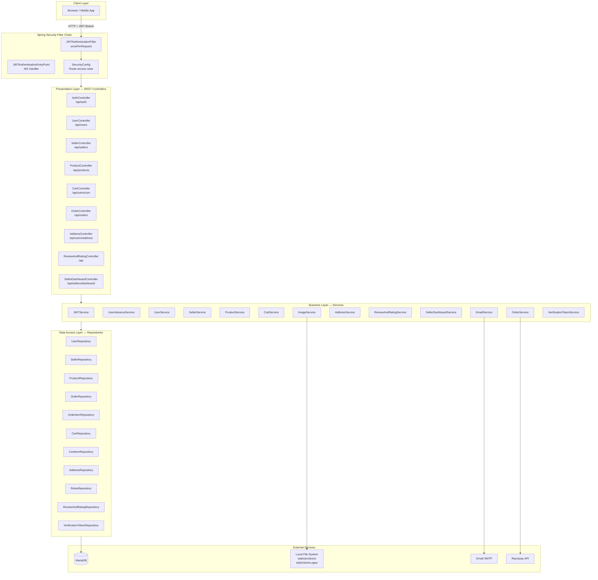
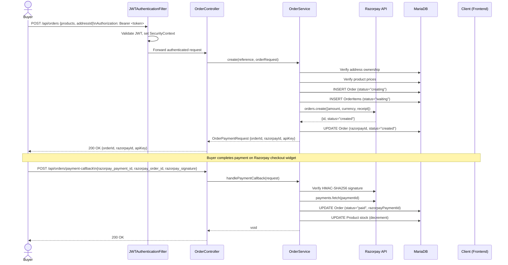
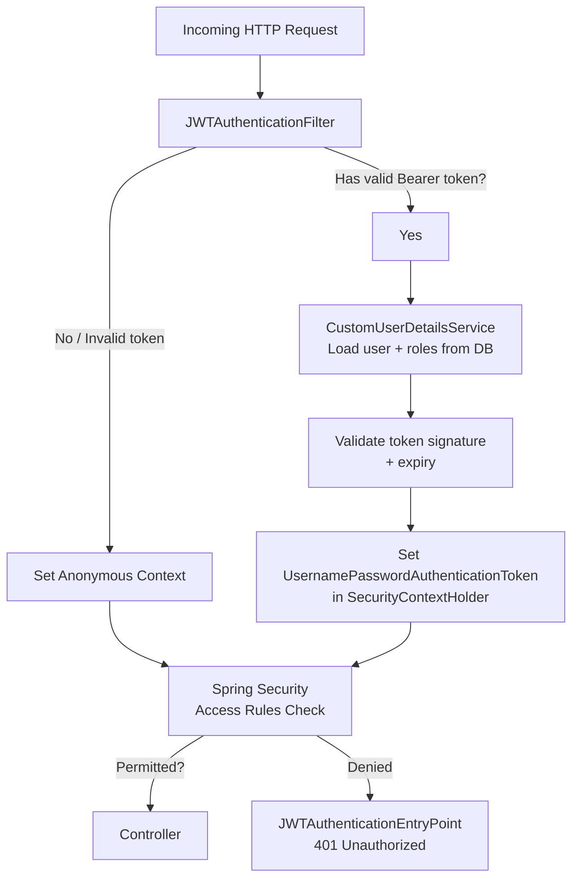

# Architecture — Stella E-Commerce Backend

> Generated: April 2, 2026 | Derived entirely from static codebase analysis.

---

## 1. System Overview

Stella is a **monolithic, layered Spring Boot REST API**. There is no frontend bundled with the backend; all HTML/JavaScript clients communicate with the server exclusively over HTTP using JSON payloads and `multipart/form-data` for file uploads.

The system implements a **classic three-tier layered architecture**:

```
Client (Browser / Mobile / Frontend App)
        │  HTTP/HTTPS (JSON + JWT Bearer token)
        ▼
┌─────────────────────────────────────────┐
│          Presentation Layer             │
│   REST Controllers  (@RestController)   │
├─────────────────────────────────────────┤
│          Business Logic Layer           │
│     Services (Interface + Impl)         │
├─────────────────────────────────────────┤
│          Data Access Layer              │
│   Repositories (Spring Data JPA)        │
├─────────────────────────────────────────┤
│          Infrastructure                 │
│   MariaDB  |  File System  |  SMTP      │
│   Razorpay API (external)               │
└─────────────────────────────────────────┘
```

Every incoming request is intercepted by the **Spring Security filter chain** before it reaches a controller. A custom `JWTAuthenticationFilter` validates the `Authorization: Bearer <token>` header on every request.

---

## 2. Architecture Diagram



---

## 3. Data Flow Diagram — Order Placement

This sequence illustrates the primary end-to-end user journey: a buyer placing and paying for an order.



---

## 4. Database Schema / Entity Relationship Diagram

```mermaid
erDiagram
    users {
        int user_id PK
        string user_name
        string email UK
        string number UK
        string password
        int active
    }

    user_roles {
        int id PK
        int user_id FK
        string role
    }

    sellers {
        int user_id PK_FK
        string store_name
        string address
        string logo
        date created_at
    }

    address {
        int id PK
        int user_id FK
        string street_address
        string city
        string state
        string postal_code
        string country
        int main
    }

    products {
        int product_id PK
        int user_id FK
        string name
        string description
        double price
        int stock
        int category_id FK
        boolean active
        string image1
        string image2
        string image3
        string image4
        string image5
        string image6
        string image7
        string image8
        string image9
    }

    product_category {
        int id PK
        string category
    }

    carts {
        int cart_id PK
        int user_id FK
        double amount
    }

    cart_items {
        int id PK
        int cart_id FK
        int product_id FK
        int quantity
        double amount
        double total_amount
    }

    orders {
        int order_id PK
        int user_id FK
        date order_date
        double total_amount
        string status
        string shipping_address
        string razorpay_id
        string razorpay_payment_id
    }

    order_items {
        int order_item_id PK
        int order_id FK
        int product_id FK
        string status
        int quantity
        double amount
        double total_amount
    }

    review_rating {
        int id PK
        int user_id FK
        int product_id FK
        int rating
        string comment
        date review_date
    }

    verification_token {
        int id PK
        string token
        int user_id FK
        date expiry_date
    }

    update_verification_token {
        int id PK
        string token
        int user_id FK
        string data
        date expiry_date
    }

    users ||--o{ user_roles : "has"
    users ||--o| sellers : "may become"
    users ||--o{ address : "has"
    users ||--o{ products : "sells"
    users ||--o{ carts : "owns"
    users ||--o{ orders : "places"
    users ||--o{ review_rating : "writes"
    users ||--o{ verification_token : "has"
    users ||--o{ update_verification_token : "has"
    products }o--|| product_category : "belongs to"
    carts ||--o{ cart_items : "contains"
    cart_items }o--|| products : "references"
    orders ||--o{ order_items : "contains"
    order_items }o--|| products : "references"
    review_rating }o--|| products : "reviews"
```

### Entity Status Enumerations

| Entity        | Field    | Allowed Values                                                                   |
| ------------- | -------- | -------------------------------------------------------------------------------- |
| `orders`      | `status` | `creating`, `created`, `paid`, `processing`, `shipped`, `delivered`, `cancelled` |
| `order_items` | `status` | `waiting`, `accepted`, `canceled`, `shipped`                                     |
| `user_roles`  | `role`   | `ROLE_BUYER`, `ROLE_SELLER`                                                      |
| `users`       | `active` | `0` (inactive/unverified), `1` (active)                                          |
| `address`     | `main`   | `0` (secondary), `1` (primary/default)                                           |

---

## 5. Key Design Patterns

### 5.1 Interface Segregation / Strategy Pattern

Every service is defined as a Java interface (e.g., `UserService`, `ProductService`) with a single `*Impl` class. This enforces a contract between layers and makes the implementations substitutable without touching callers.

### 5.2 Repository Pattern

All database access goes through Spring Data JPA repository interfaces. No SQL is written in services — queries are either derived method names (e.g., `findByUserId`) or rely on JPA's built-in CRUD operations.

### 5.3 DTO (Data Transfer Object) Pattern

The `model/` package contains dedicated request and view-model classes that are distinct from JPA entities. Controllers and services exchange DTOs, never raw entities — preventing over-exposure of internal database structure.

### 5.4 Global Exception Handler

A single `@ControllerAdvice` class (`GlobalExceptionHandler`) intercepts all unhandled exceptions and maps them to structured HTTP responses. Custom exception classes in `exception/` represent domain-specific error conditions.

### 5.5 JWT Stateless Authentication

The application is fully stateless — `SessionCreationPolicy.STATELESS` is configured in Spring Security. Identity is established on every request through the `JWTAuthenticationFilter`, which validates the token, loads `UserDetails`, and populates `SecurityContextHolder`.

### 5.6 Two-Step Email Verification

Both user registration and sensitive field updates (email, phone) follow a two-step pattern:

1. An action creates a time-limited token in the database and sends it by email.
2. A separate `verify-*` endpoint confirms the token, applies the change, and deletes the token.

Two separate token tables (`verification_token`, `update_verification_token`) handle registration vs. profile update flows.

### 5.7 Razorpay Two-Phase Payment

Orders are created in a "creating" state. The backend calls Razorpay to create a payment order and returns the `razorpayId` and `apiKey` to the client. After the client completes payment, it sends a callback with HMAC-SHA256 signature; the backend verifies the signature with Razorpay before marking the order "paid".

### 5.8 Role-Based Access Control

Spring Security `hasRole()` expressions on individual routes enforce buyer-only and seller-only access at the HTTP layer, before any controller code executes.

---

## 6. Security Architecture



---

## 7. File Storage Architecture

Product images and seller logos are stored on the **local filesystem** under the `src/main/resources/static/` directory, served as static resources by Spring Boot.

```
static/
├── products/
│   └── {userId}/
│       └── {productName}/
│           ├── 0.jpg
│           ├── 1.png
│           └── ...  (up to 9 images)
└── storeLogos/
    └── {userId}/
        └── logo.{ext}
```

`ImageService` validates file extensions (`jpg`, `jpeg`, `png`, `gif`, `bmp`) and uses Apache Commons IO `FileUtils.copyInputStreamToFile` to write files. Up to **9 images** per product are supported, stored as absolute filesystem paths in `product.image1` … `product.image9` columns.

---

_Blueprint generated on April 2, 2026. Re-generate after significant architectural changes._
