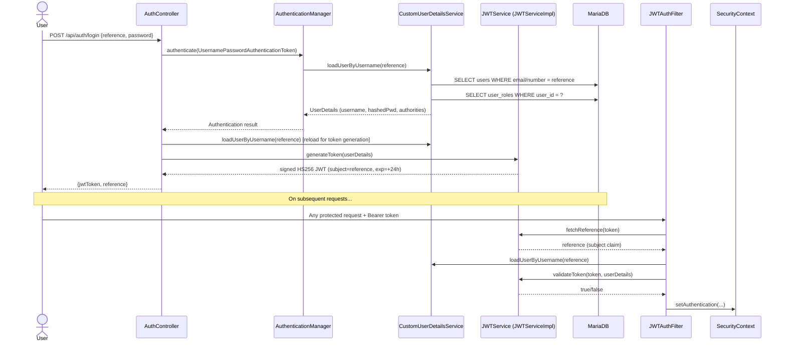
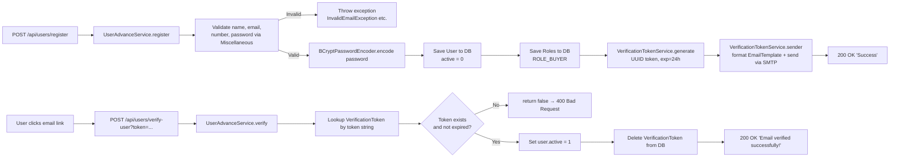
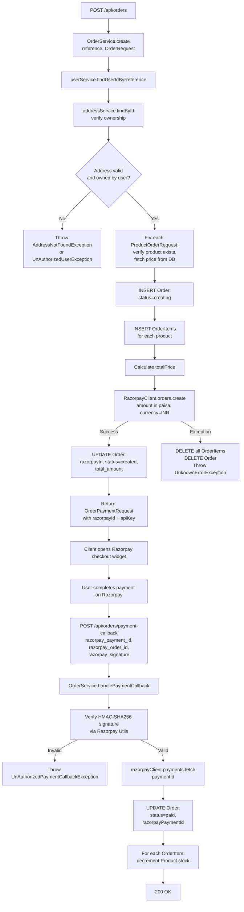
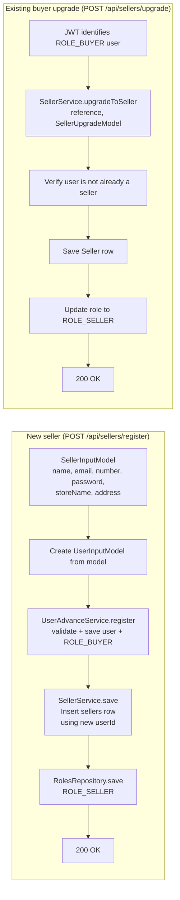

# Backend Flow — Stella E-Commerce Backend

> Generated: April 2, 2026 | Derived entirely from static codebase analysis.

---

## 1. Request Lifecycle

Every HTTP request passes through the following pipeline before any business code executes:

```mermaid
flowchart TD
    A[HTTP Request arrives at Tomcat] --> B[Spring Security Filter Chain]
    B --> C{Has Authorization header?\nstarts with 'Bearer '}
    C -- Yes --> D[JWTAuthenticationFilter\nextract token]
    C -- No --> E[Continue as anonymous]
    D --> F[JWTService.fetchReference\ndecode subject claim]
    F --> G[CustomUserDetailsService\nloadUserByUsername]
    G --> H[UserService.get — fetch User from DB]
    H --> I[RolesRepository.findByUserId\nfetch roles from DB]
    I --> J[JWTService.validateToken\ncheck username + expiry]
    J -- Valid --> K[Set UsernamePasswordAuthenticationToken\nin SecurityContextHolder]
    J -- Invalid --> L[Log error, continue anonymous]
    K --> M[SecurityConfig access rules evaluated]
    E --> M
    L --> M
    M -- Permitted --> N[DispatcherServlet routes to Controller]
    M -- Denied --> O[JWTAuthenticationEntryPoint\n401 Unauthorized plain text]
    N --> P[Controller extracts reference\nfrom JWT via JWTService.fetchReference]
    P --> Q[Service layer executes business logic]
    Q --> R[Repository layer — Spring Data JPA]
    R --> S[(MariaDB)]
    Q --> T{Exception thrown?}
    T -- Yes --> U[GlobalExceptionHandler\n@ControllerAdvice]
    U --> V[Structured HTTP error response]
    T -- No --> W[Controller serializes response to JSON]
    W --> X[HTTP Response to Client]
```

### Step-by-step Summary

| Step | Component                                | Responsibility                                                                |
| ---- | ---------------------------------------- | ----------------------------------------------------------------------------- |
| 1    | Tomcat                                   | Receives raw HTTP/HTTPS request                                               |
| 2    | `JWTAuthenticationFilter`                | Checks `Authorization` header; decodes JWT; populates `SecurityContextHolder` |
| 3    | Spring Security rules (`SecurityConfig`) | Evaluates `hasRole()` guards per path/method                                  |
| 4    | `JWTAuthenticationEntryPoint`            | Returns `401` for denied requests                                             |
| 5    | Controller                               | Routes request; re-extracts JWT reference for ownership checks                |
| 6    | Service (`*Impl`)                        | Validates inputs, orchestrates repositories, and applies business rules       |
| 7    | Repository                               | Performs CRUD via Hibernate/JPA                                               |
| 8    | `GlobalExceptionHandler`                 | Catches any uncaught exception and maps it to an HTTP response                |

---

## 2. JWT Token Lifecycle



**Key implementation detail:** The JWT signing key is generated **in-memory** at application startup (`Jwts.SIG.HS256.key().build()`). This means **all tokens are invalidated on server restart**. There is no persistent key store.

---

## 3. User Registration & Email Verification Flow



### Profile Update Verification (Email / Number)

Sensitive field changes (email, phone) follow a **two-phase commit** pattern:

1. `PUT /api/users/email` or `/number` → validates new value, saves an `UpdateVerificationToken` with format `"email:<new_value>"` or `"number:<new_value>"`, sends link to the **new** email.
2. `POST /api/users/verify-update?token=...` → reads prefix from `data` field, applies the change to the user, deletes the token.

---

## 4. Order Creation & Payment Flow (Core Process)

This is the most complex flow in the system. It involves two HTTP calls and an external payment provider.



### Rollback Strategy

If any step from Razorpay order creation onwards fails, the service **manually deletes** the `Order` and all associated `OrderItems` to maintain database consistency. There is no `@Transactional` annotation on this method — cleanup is done imperatively in the catch block.

---

## 5. Seller Registration & Upgrade Flow



---

## 6. Product Image Storage Flow

```mermaid
flowchart TD
    A[POST/PUT /api/products\nmultipart/form-data] --> B[ProductController]
    B --> C[ProductService.save or .update]
    C --> D[ImageService.save\nuserId, productName, images, basePath]
    D --> E{For each MultipartFile...}
    E --> F[Validate extension\njpg, jpeg, png, gif, bmp]
    F -- Invalid --> G[Throw InvalidImageExtensionException]
    F -- Valid --> H[Build path:\nstatic/products/{userId}/{name}/{index}.{ext}]
    H --> I[Create directories if absent]
    I --> J[FileUtils.copyInputStreamToFile\nApache Commons IO]
    J --> K[Collect absolute path strings]
    K --> L[Return List of image paths]
    L --> M[Assign to product.image1...image9]
    M --> N[productRepository.save]
```

Images are served as static resources by Spring Boot from `src/main/resources/static/`. Clients access them at `/products/{userId}/{name}/{index}.{ext}`.

---

## 7. Error Handling Strategy

### Global Exception Handler (`GlobalExceptionHandler`)

A `@ControllerAdvice` class intercepts all exceptions that escape service/controller methods and maps them to HTTP responses.

| Exception Type               | HTTP Status       | Response Body Shape                                    |
| ---------------------------- | ----------------- | ------------------------------------------------------ |
| `UserNotFoundException`      | `404 Not Found`   | `NotFoundErrorResponse {status, message, timestamp}`   |
| `AddressNotFoundException`   | `404 Not Found`   | `NotFoundErrorResponse {status, message, timestamp}`   |
| `IllegalArgumentException`   | `400 Bad Request` | `IllegalArgumentResponse {status, message, timestamp}` |
| `UserExistException`         | `400 Bad Request` | Plain string message                                   |
| Any other `RuntimeException` | `400 Bad Request` | Plain string message                                   |

### Controller-Level Catch Blocks

Every controller method wraps service calls in try-catch blocks. The pattern is:

```
try {
    // call service
} catch (SpecificDomainException e) {
    throw e;   // re-throw — handled by GlobalExceptionHandler
} catch (Exception e) {
    logger.error(...);
    throw new UnknownErrorException("Error: unknown error");  // safe fallback
}
```

This ensures that:

1. Domain exceptions propagate with their original messages and HTTP mappings.
2. Unexpected exceptions are logged server-side but only expose a generic message to the client (preventing information leakage).

### Custom Exception Hierarchy

All domain exceptions extend `RuntimeException`, allowing them to propagate through the stack without checked-exception boilerplate. Examples:

```
RuntimeException
├── UserException (base for user domain)
│   ├── UserNotFoundException
│   ├── UserExistException
│   └── UnAuthorizedUserException
├── ProductException (base for product domain)
│   ├── InvalidProductException
│   ├── InvalidProductIdException
│   └── UsedProductNameException
├── SellerException
│   ├── SellerNotFoundException
│   └── SellerExistsException
├── OrderException
│   ├── OrderNotFoundException
│   └── InvalidOrderIdException
├── ImageException
│   ├── EmptyImagesException
│   └── InvalidImageExtensionException
└── JwtException / InvalidJWTHeaderException
```

---

## 8. Input Validation

Validation is performed **manually** in service code via the `Miscellaneous` utility class and guard clauses — there is no Jakarta Bean Validation (`@Valid`) used. Key validators:

| Validator                       | Rule                                                                       |
| ------------------------------- | -------------------------------------------------------------------------- |
| `Miscellaneous.isValidEmail`    | Regex: `[a-zA-Z0-9._%+-]+@[a-zA-Z0-9.-]+\.[a-zA-Z]{2,4}`                   |
| `Miscellaneous.isValidNumber`   | Regex: exactly 10 digits                                                   |
| `Miscellaneous.isValidPassword` | Min 8 chars, must have upper, lower, digit, and special character          |
| JWT header validation           | `JWTService.verifyJwtHeader` — must be non-null and start with `"Bearer "` |
| Product category                | Checked against `product_category` table                                   |
| Image extension                 | Allowed list: `jpg`, `jpeg`, `png`, `gif`, `bmp`                           |
| Rating                          | Service enforces 1–5 integer range                                         |
| Comment length                  | `CommentExceedsLimitException` thrown if too long (checked in service)     |

---

## 9. Asynchronous / Background Tasks

The application has **no background jobs, message queues, or scheduled tasks**. All operations are synchronous within the request-response cycle. Notable implications:

- **Email sending** (`EmailService.sendEmail`) is called synchronously inside service methods. A slow or unreachable SMTP server will delay the HTTP response. Errors are caught and logged but do not fail the user-facing operation.
- **Razorpay API calls** are synchronous HTTP calls via the SDK. A Razorpay outage will cause order creation to fail and trigger the manual rollback path.
- **File I/O** (image saving) is performed synchronously. Large uploads block the request thread until all files are written to disk.

---

## 10. Caching Strategy

There is **no application-level caching** (no `@Cacheable`, no Redis, no in-memory cache). Every request performs fresh database reads. The only in-memory state is the JWT signing key held in `JWTServiceImpl` as a class-level field.

---

_Document generated April 2, 2026. Update after changes to service orchestration, security configuration, or payment integration._
